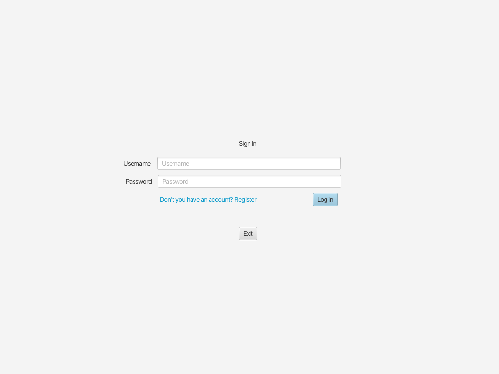
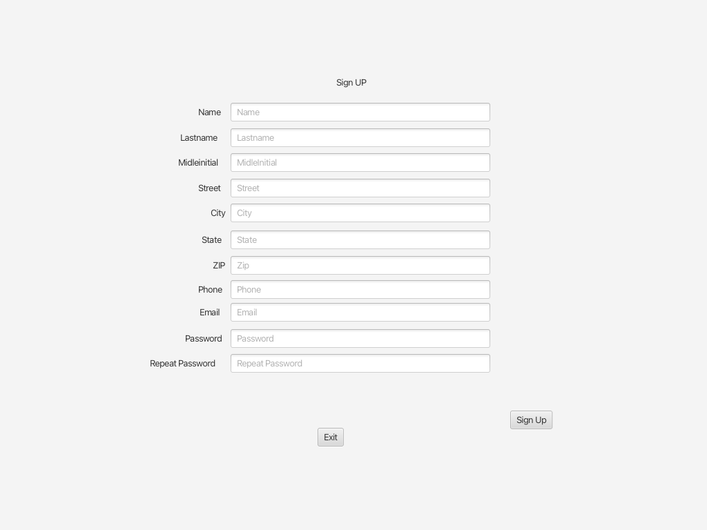
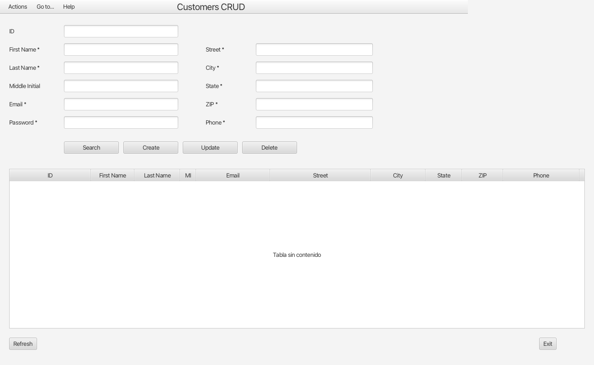
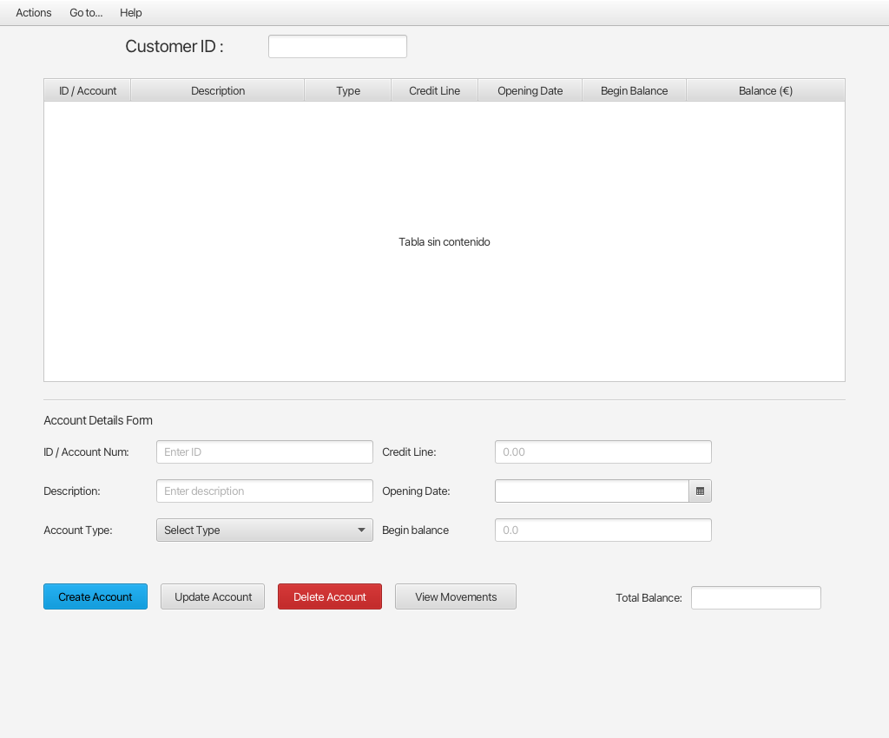
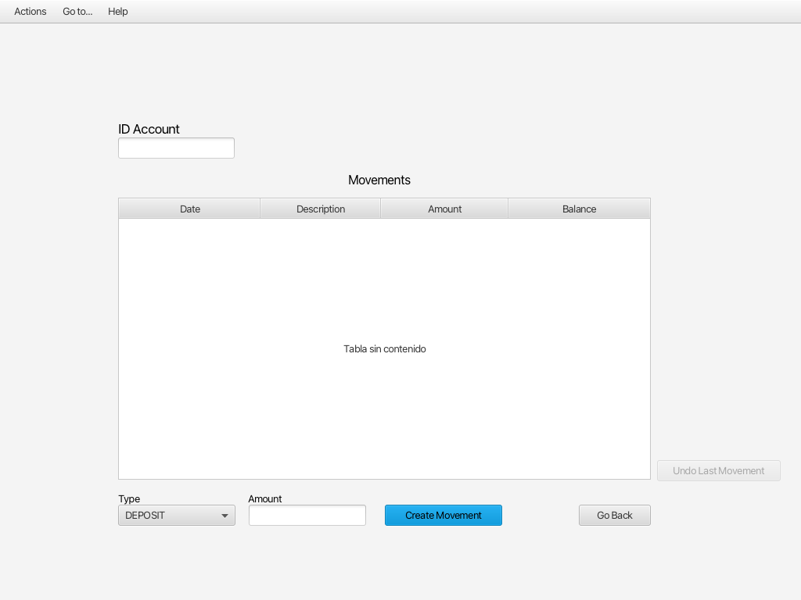

# CRUD Project — Cliente JavaFX de gestión bancaria

Aplicación de escritorio **JavaFX** para la gestión de una entidad bancaria
(clientes, cuentas y movimientos). Es el **cliente** de una arquitectura
cliente–servidor: consume una API REST servida por un backend Java EE
independiente (`CRUDBankServerSide`).

> ℹ️ **Proyecto de equipo.** Desarrollado en grupo como proyecto formativo
> (ver [Créditos](#créditos)). Esta copia recopila el trabajo y lo documenta
> para el portfolio personal.

## Funcionalidades

- **Inicio de sesión (Sign In):** según las credenciales se entra como
  **administrador** o como **usuario normal**.
- **Administrador:** crea, consulta, actualiza y elimina *Customers* (clientes).
- **Usuario normal:** crea cuentas asociadas a su propio cliente, de tipo
  **estándar** o **crédito**.
- **Movimientos:** asociados a una cuenta, permiten registrar **pagos** y
  **depósitos**.
- **Informes:** generación de informes de clientes, cuentas y movimientos con
  **JasperReports** (`.jrxml` / `.jasper`).
- **Cambio de contraseña** desde la propia aplicación.

## Arquitectura

```
┌─────────────────────────┐        REST (JSON/XML)        ┌───────────────────────────┐
│   CRUD_Project (este)    │  ───────────────────────────▶ │   CRUDBankServerSide       │
│   Cliente JavaFX         │   http://localhost:8080/...   │   Backend Java EE (Payara) │
│   (Jersey JAX-RS client) │ ◀───────────────────────────  │   + MySQL                  │
└─────────────────────────┘                                └───────────────────────────┘
```

El cliente ataca por defecto a la URL base:
`http://localhost:8080/CRUDBankServerSide/webresources`.

> ⚠️ **Importante:** este repositorio contiene **solo el cliente**. Para que la
> aplicación funcione de extremo a extremo necesitas el backend
> `CRUDBankServerSide` desplegado en un servidor Payara con su base de datos
> MySQL. Sin ese servidor la aplicación arranca pero no podrá comunicarse con
> los servicios REST.

## Estructura del proyecto

```
CRUD_Project/
├── src/
│   ├── CRUD_Project.java              # Punto de entrada (JavaFX Application)
│   └── CRUD_Project/
│       ├── logic/                     # Clientes REST (Jersey/JAX-RS)
│       │   ├── AccountRESTClient.java
│       │   ├── CustomerRESTClient.java
│       │   └── MovementRESTClient.java
│       ├── model/                     # Entidades (Account, Customer, Movement, AccountType)
│       └── ui/                        # Controladores + vistas FXML
│           ├── *.fxml
│           ├── *Controller.java
│           └── report/                # Plantillas JasperReports (.jrxml/.jasper)
└── test/                             # Tests JUnit de los controladores
```

## Tecnologías

- **Java** + **JavaFX** (interfaz con FXML)
- **Jersey / JAX-RS** (`javax.ws.rs`) para el cliente REST
- **JasperReports** para informes
- **JUnit** para los tests
- Pensado para desarrollarse con **NetBeans**

## Requisitos

- JDK compatible con la versión de JavaFX utilizada
- JavaFX SDK
- Librerías de Jersey (cliente JAX-RS) y JasperReports
- El backend `CRUDBankServerSide` (Payara + MySQL) para la funcionalidad completa

## Cómo ejecutar

1. Despliega primero el backend `CRUDBankServerSide` en Payara y configura su
   base de datos MySQL (crea las tablas necesarias).
2. Abre el proyecto en NetBeans (o compila con el JavaFX SDK y las librerías
   indicadas en el *classpath*).
3. Ejecuta la clase principal `CRUD_Project` (carga `SignIn.fxml`).
4. Accede como administrador con las credenciales por defecto:
   - **Usuario:** `admin`
   - **Contraseña:** `admin`

> **Nota:** al depender del backend y de librerías externas (JavaFX, Jersey,
> JasperReports) que no se incluyen aquí, este repositorio **no se compila de
> forma aislada**. Documenta el cliente; para un build funcional necesitas el
> entorno completo descrito arriba.

## Capturas

Renderizadas desde la propia aplicación JavaFX. Las tablas aparecen vacías
porque el backend REST no está en ejecución (ver nota de arquitectura), pero
las vistas, formularios y navegación son las reales de la app.

| Inicio de sesión | Registro |
|:---:|:---:|
|  |  |

**Gestión de clientes (Customers CRUD)**



**Gestión de cuentas (Accounts)**



**Movimientos (Movements)**



## Créditos

Proyecto de equipo desarrollado por:

- **Daniel López López** ([@daaniidam](https://github.com/daaniidam))
- Chad
- Imad

## Licencia

Distribuido bajo licencia [MIT](LICENSE).
